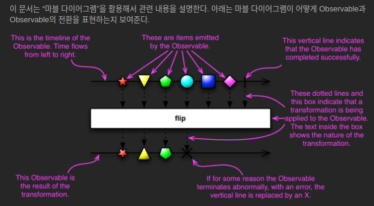

# 1. Reactive Programming

> In computing, reactive programming is a **declarative programming** paradigm  
> concerned with **data streams** and **the propagation of change.**

변화의 전파, 데이터 흐름과 관련된 선언적 프로그래밍

## 용어

- Observable: 데이터 소스
- 리액티브 연산자(Operators): 데이터 소스를 처리하는 함수
- 스케줄러(Scheduler): 스레드 관리자
- Subscriber: Observable이 발행하는 데이터를 구독하는 구독자

## 데이터 흐름

- 발행
- 가공
- 구독

## 마블 다이어 그램

리액티브 프로그래밍을 통해 발생하는  
**비동기적인 데이터의 흐름을 시간의 흐름에 따라** 시각적으로 표시한 다이어그램

[Observable with marble diagram](https://reactivex.io/documentation/ko/observable.html)

[Operator Marble Diagram](https://rxmarbles.com/)

