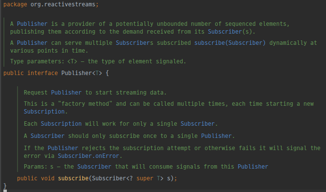
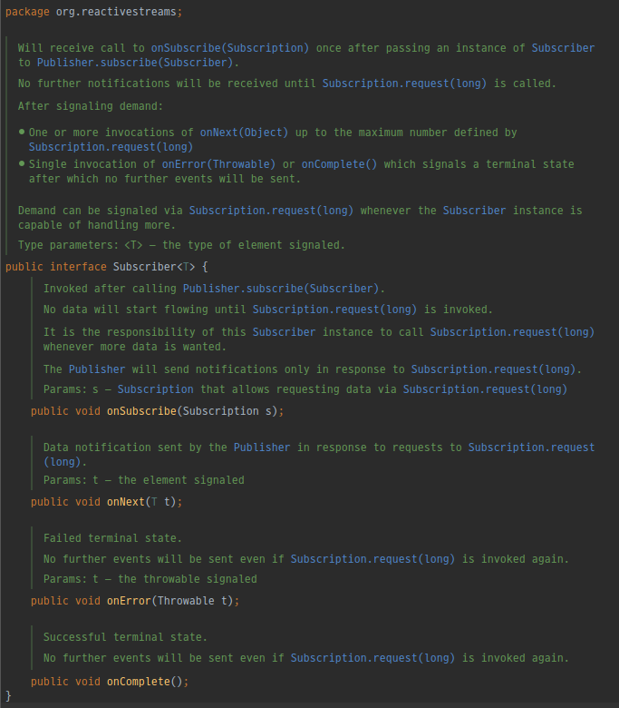
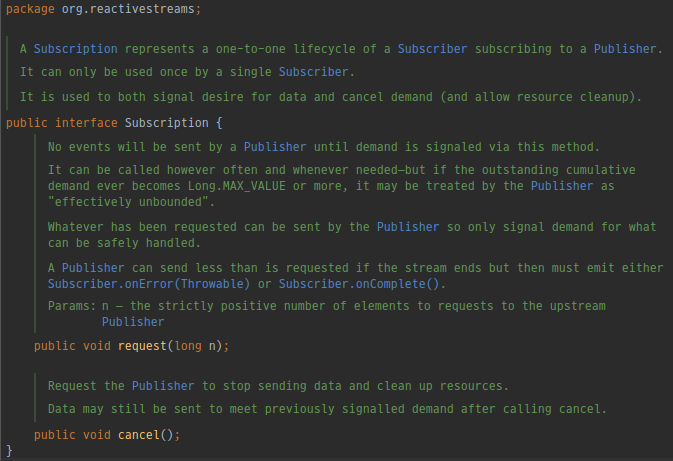

# Reactive Streams Example

[[Refer] Springboot-WebFlux 5강 - reactive streams](https://youtu.be/6TiUCm3K_IE)

## Application

[Example Application](../src/main/java/me/zeroest/rxjava/reactiveexample/ReactiveExampleApp.java)

### Publisher

[Example Publisher](../src/main/java/me/zeroest/rxjava/reactiveexample/NewspaperPublisher.java)

### Subscriber

[Example Subscriber](../src/main/java/me/zeroest/rxjava/reactiveexample/NewspaperSubscriber.java)

### Subscription

[Example Subscription](../src/main/java/me/zeroest/rxjava/reactiveexample/NewspaperSubscription.java)

