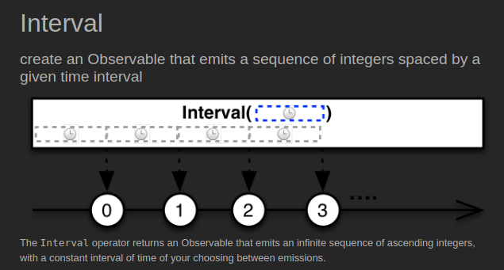
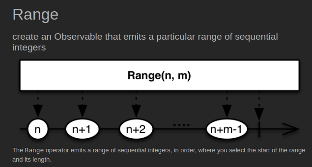
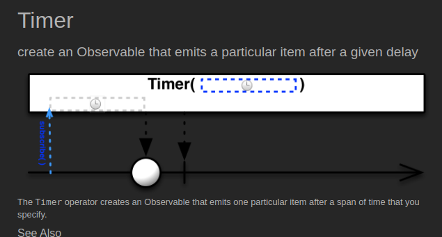
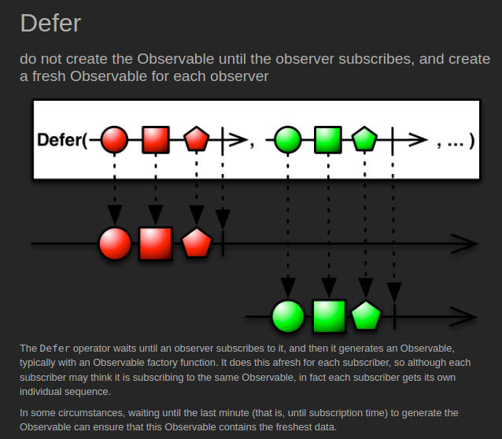
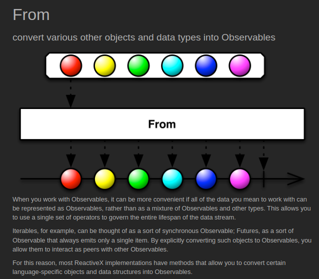

# Creating

## [Interval](https://reactivex.io/documentation/operators/interval.html) ([Example Code](../src/main/java/me/zeroest/rxjava/operators/creating/Interval.java))

- 지정한 시간 간격마다 0부터 시작하는 숫자(Long)를 통지한다.
- initialDelay 파라미터 이용해서 최초 통지에 대한 대기 시간을 지정할 수 있다.
- 완료 없이 계속 통지한다.
- 호출한 스레드와는 별도의 스레드에서 실행된다. (RxComputationThreadPool)
- polling 용도의 작업을 수행할 때 활용할 수 있다.

## [Range](https://reactivex.io/documentation/operators/range.html) ([Example Code](../src/main/java/me/zeroest/rxjava/operators/creating/Range.java))

- 지정한 값(n)부터 m개의 숫자(Integer)를 통지한다.
- for, while 문 등의 반복문을 대체할 수 있다.

## [Timer](https://reactivex.io/documentation/operators/timer.html) ([Example Code](../src/main/java/me/zeroest/rxjava/operators/creating/Timer.java))

- 지정한 시간이 지나면 0(Long)을 통지한다.
- 0을 통지하고 onComplete() 이벤트가 발생하여 종료한다.
- 호출한 스레드와는 별도의 스레드에서 실행된다.
- 특정 시간을 대기한 후에 어떤 처리를 하고자 할 때 활용할 수 있다.

## [Defer](https://reactivex.io/documentation/operators/defer.html) ([Example Code](../src/main/java/me/zeroest/rxjava/operators/creating/Defer.java))

- 구독이 발생할 때마다 즉, subscribe()가 호출될 때마다 새로운 Observable을 생성한다.
- 선언한 시점의 데이터를 통지하는 것이 아니라 호출 시점의 데이터를 통지한다.
- 데이터 생성을 미루는 효과가 있기 때문에 최신의 데이터를 얻고자 할 때 활용할 수 있다.

## [FromIterable](https://reactivex.io/documentation/operators/from.html) ([Example Code](../src/main/java/me/zeroest/rxjava/operators/creating/FromIterable.java))

- Iterable 인터페이스를 구현한 클래스(ArrayList 등)를 파라미터로 받는다.
- Iterable에 담긴 데이터를 순서대로 통지한다.

## [FromFuture](https://reactivex.io/documentation/operators/from.html) ([Example Code](../src/main/java/me/zeroest/rxjava/operators/creating/FromFuture.java))

[Future Example](../src/main/java/me/zeroest/rxjava/operators/creating/FutureExample.java)

- Future 인터페이스는 자바 5에서 비동기 처리를 위해 추가된 동시성 API
- 시간이 오래 걸리는 작업은 Future를 반환하는 ExecutorService에게 맡기고 비동기로 다른 작업을 수행할 수 있다.
- Java 8에서는 CompletableFuture 클래스를 통해 구현이 간결해 졌다.
