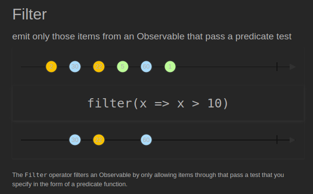
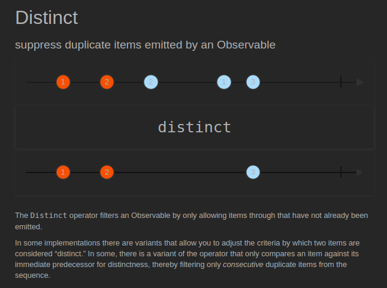
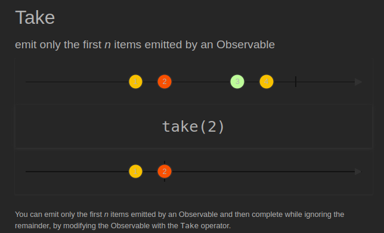
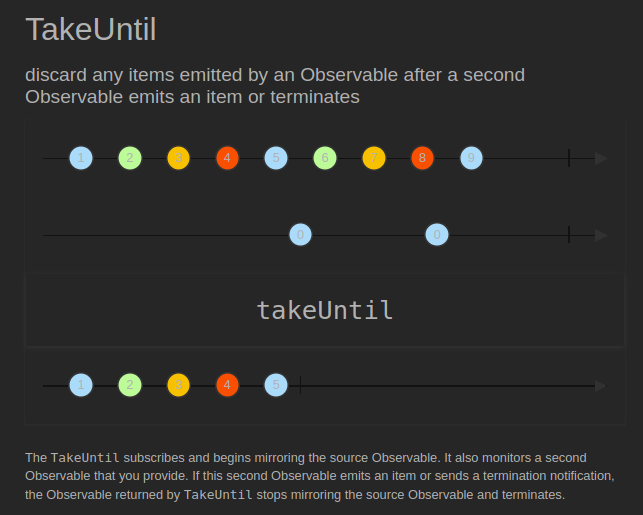
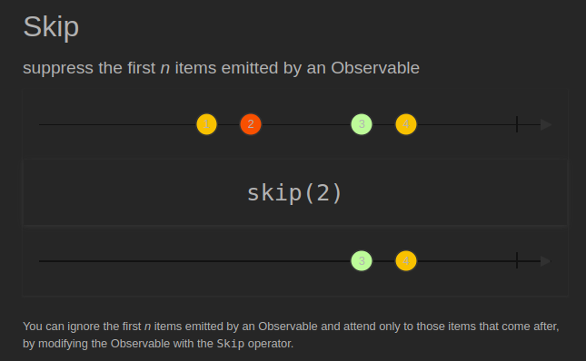

# Filtering

[[Docs] Filtering Observables](https://reactivex.io/documentation/operators.html#filtering)

## [Filter](https://reactivex.io/documentation/operators/filter.html) ([Example Code](../src/main/java/me/zeroest/rxjava/operators/filtering/Filter.java))

- 전달 받은 데이터가 조건에 맞는지 확인한 후, 결과가 true인 데이터만 통지한다.
- filter라는 단어의 사전적 의미가 무언가를 걸러낸다는 의미.
- 파라미터로 받는 Predicate 함수형 인터페이스에서 조건을 확인한다.

## [Distinct](https://reactivex.io/documentation/operators/distinct.html) ([Example Code](../src/main/java/me/zeroest/rxjava/operators/filtering/Distinct.java))

- 이미 통지된 동일한 데이터가 있다면 이후의 동일한 데이터는 통지 하지 않는다.
- distinct의 사전적 의미는 '명확하게 구별되는'이라는 뜻을 포함.

## [Take](https://reactivex.io/documentation/operators/take.html) ([Example Code](../src/main/java/me/zeroest/rxjava/operators/filtering/Take.java))

- 파라미터로 지정한 개수나 기간이 될 때까지 데이터를 통지한다.
- 지정한 위가 통지 데이터보다 클 경우 데이터를 모두 통지하고 완료한다.

## [TakeUntil](https://reactivex.io/documentation/operators/takeuntil.html) ([Example Code](../src/main/java/me/zeroest/rxjava/operators/filtering/TakeUntil.java))

유형1
- 파라미터로 지정한 조건이 true가 될 때까지 데이터를 계속 통지한다.

유형2  
- 파라미터로 지정한 Observable이 최초 데이터를 통지할 때까지 데이터를 계속 통지한다.

## [Skip](https://reactivex.io/documentation/operators/skip.html) ([Example Code](../src/main/java/me/zeroest/rxjava/operators/filtering/Skip.java))

유형1
- 파라미터로 지정한 숫자만큼 데이터를 건너뛴 후 나머지 데이터를 통지한다.

유형2
- 파라미터로 지정한 시간 동안에는 데이터 통지를 건너뛴 후 지정한 시간 이 후, 나머지 데이터를 통지한다.
