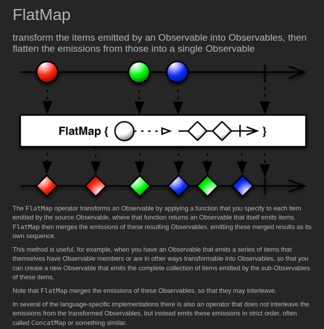
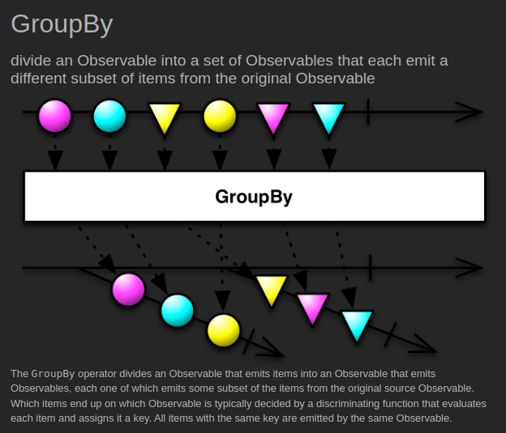

# Transforming

[[Docs] Transforming Observables](https://reactivex.io/documentation/operators.html#transforming)

## [Map](https://reactivex.io/documentation/operators/map.html) ([Example Code](../src/main/java/me/zeroest/rxjava/operators/transforming/Map.java))

- 원본 Observable에서 통지하는 데이터를 원하는 값으로 변환 후 통지한다.
- 변환 전, 후 데이터 타입은 달라도 상관 없다.
- null을 반환하면 NPE이 발생하므로 null이 아닌 데이터 하나를 반드시 반환해야 한다.

## [FlatMap](https://reactivex.io/documentation/operators/flatmap.html) ([Example Code](../src/main/java/me/zeroest/rxjava/operators/transforming/FlatMap.java))

유형1
- 원본 데이터를 원하는 값으로 변환 후 통지하는것은 map과 같다.
- map이 1대1 변환인 것과 달리 flatMap은 1대다 변환하므로 데이터 한개로 여러 데이터를 통지할 수 있다.
- map은 변환된 데이터를 반환하지만 flatMap은 변환 된 여러개의 데이터를 담고 있는 새로운 Observable을 반환한다.

유형2
- 원본 데이터와 변환된 데이터를 조합해서 새로운 데이터를 통지한다.
- 즉, Observable에 **원본 데이터 + 변환된 데이터 = 최종 데이터** 를 실어서 반환한다.

## [ConcatMap](https://reactivex.io/documentation/operators/flatmap.html) ([Example Code](../src/main/java/me/zeroest/rxjava/operators/transforming/ConcatMap.java))

- flatMap과 마찬가지로 받은 데이터를 변환하여 새로운 Observable로 반환한다.
- 반환된 새로운 Observable을 하나씩 순서대로 실행하는것이 flatMap과 다르다.
- 즉, 데이터의 처리 순서는 보장하지만 처리중인 Observable의 처리가 끝나야 다음 Observable이 실행되므로 처리 성능에는 영향을 줄 수 있다.

## [SwitchMap](https://reactivex.io/documentation/operators/flatmap.html) ([Example Code](../src/main/java/me/zeroest/rxjava/operators/transforming/SwitchMap.java))

- concatMap과 마찬가지로 받은 데이터를 변환하여 새로운 Observable로 반환한다.
- concatMap과 다른점은 switchMap은 숭서를 보장하지만 새로운 데이터가 통지되면 현재 처리중이던 작업을 바로 중단한다.

---

## [GroupBy](https://reactivex.io/documentation/operators/groupby.html) ([Example Code](../src/main/java/me/zeroest/rxjava/operators/transforming/GroupBy.java))

- 하나의 Observable을 여러개의 새로운 GroupedByObservable로 만든다.
- 원본 Observable의 데이터를 그룹별로 묶는다기 보다는 각각의 데이터들이 그룹에 해당하는 Key를 가지게 된다.
- GroupedByObservable은 getKey()를 통해 구분된 그룹을 알 수 있게 해준다.

## [ToList](https://reactivex.io/documentation/operators/to.html) ([Example Code](../src/main/java/me/zeroest/rxjava/operators/transforming/ToList.java))

- 통지 되는 데이터를 모두 List에 담아 통지한다.
- 원본 Observable에서 완료 통지를 받는 즉시 리스트를 통지한다.
- 통지되는 데이터는 원본 데이터를 담은 리스트 하나이므로 Single로 반환된다.

## [ToMap](https://reactivex.io/documentation/operators/to.html) ([Example Code](../src/main/java/me/zeroest/rxjava/operators/transforming/ToMap.java))

- 통지 되는 데이터를 모두 Map에 담아 통지한다.
- 원본 Observable에서 완료 통지를 받는 즉시 Map을 통지한다.
- 이미 사용중인 Key(키)를 또 생성하면 기존에 있던 Key(키)와 value(값)를 덮어쓴다.
- 통지되는 데이터는 원본 데이터를 담은 Map 하나이므로 Single로 반환된다.
