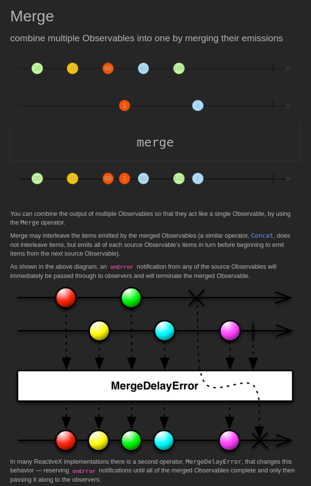
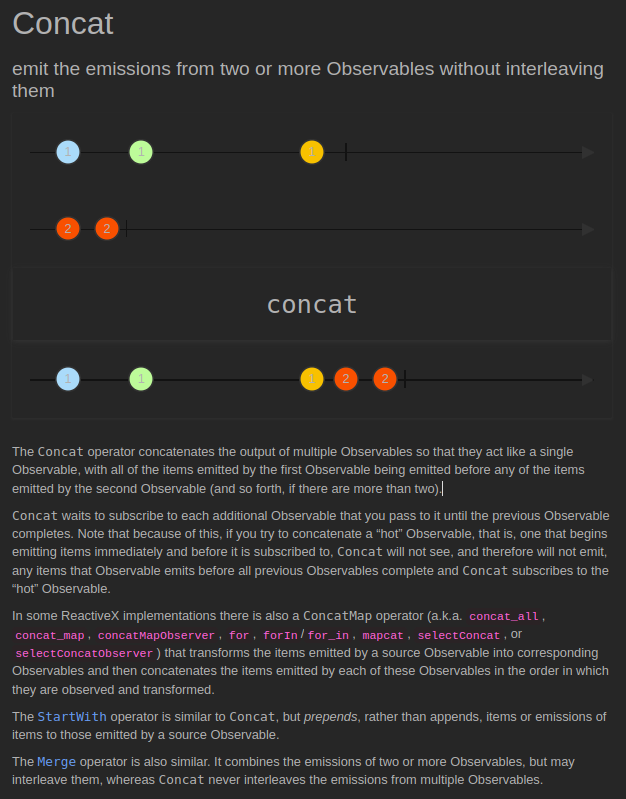
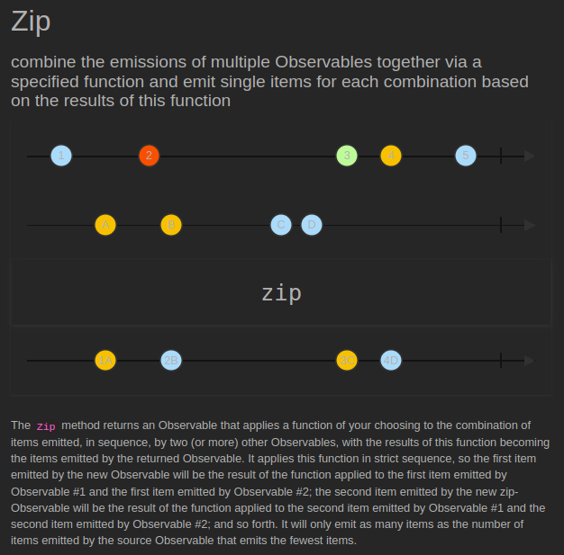
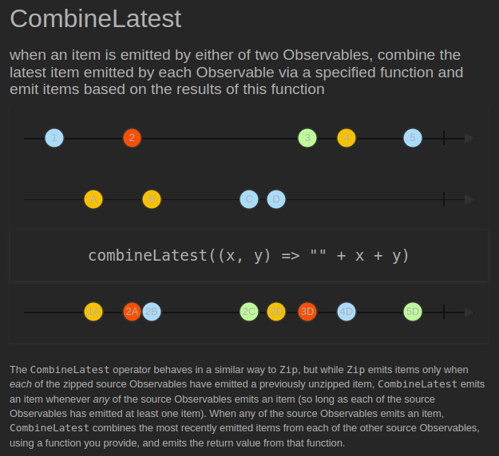

# Combining

[[Docs] Combining Observables](https://reactivex.io/documentation/operators.html#combining)

## [Merge](https://reactivex.io/documentation/operators/merge.html) ([Example Code](../src/main/java/me/zeroest/rxjava/operators/combining/Merge.java))

- 다수의 Observable에서 통지된 데이터를 받아서 다시 하나의 Flowable/Observable로 통지한다.
- 통지 시점이 빠른 Observable의 데이터부터 순차적으로 통지되고 통지 시점이 같을 경우에는  
merge()함수의 파라미터로 먼저 지정된 Observable의 데이터부터 통지된다.

## [Concat](https://reactivex.io/documentation/operators/concat.html) ([Example Code](../src/main/java/me/zeroest/rxjava/operators/combining/Concat.java))

- 다수의 Observable에서 통지된 데이터를 받아서 다시 하나의 Observable로 통지한다.
- 하나의 Observable에서 통지가 끝나면 다음 Observable에서 연이어서 통지가 된다.
- 각 Observable의 통지 시점과는 상관 없이 concat() 함수의 파라미터로 먼저 입력된 Observable의 데이터부터 모두 통지 된 후, 다음 Observable의 데이터가 통지된다.

## [Zip](https://reactivex.io/documentation/operators/zip.html) ([Example Code](../src/main/java/me/zeroest/rxjava/operators/combining/Zip.java))

- 다수의 Observable에서 통지된 데이터를 받아서 다시 하나의 Observable로 통지한다.
- 각 Observable에서 통지된 데이터가 모두 모이면 각 Observable에서 동일한 index의 데이터로 새로운 데이터를 생성한 후 통지한다.
- 통지하는 데이터 개수가 가장 적은 Observable의 통지 시점에 완료 통지 시점을 맞춘다.

## [CombineLatest](https://reactivex.io/documentation/operators/combinelatest.html) ([Example Code](../src/main/java/me/zeroest/rxjava/operators/combining/CombineLatest.java))

- 다수의 Observable에서 통지된 데이터를 받아서 다시 하나의 Observable로 통지한다.
- 각 Observable에서 데이터를 통지할 때마다 모든 Observable에서 마지막으로 통지한 각 데이터를 함수형 인터페이스에 전달하고, 새로운 데이터를 생성해 통지한다.

