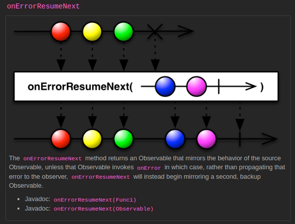

# Error Handling

[[Docs] Error Handling Operators](https://reactivex.io/documentation/operators.html#error)

## [OnErrorReturn](https://reactivex.io/documentation/operators/catch.html) ([Example Code](../src/main/java/me/zeroest/rxjava/operators/errorhandling/OnErrorReturn.java))

- 에러가 발생했을 때 에러를 의미하는 데이터로 대체할 수 있다.
- onErrorReturn()을 호출하면 onError 이벤트는 발생하지 않는다.

## [OnErrorResumeNext](https://reactivex.io/documentation/operators/catch.html) ([Example Code](../src/main/java/me/zeroest/rxjava/operators/errorhandling/OnErrorResumeNext.java))

- 에러가 발생했을 때 에러를 의미하는 Observable로 대체할 수 있다.
- Observable로 대체할 수 있으므로 데이터 교체와 더불어 에러 처리를 위한 추가 작업을 할 수 있다.

## [Retry](https://reactivex.io/documentation/operators/retry.html) ([Example Code](../src/main/java/me/zeroest/rxjava/operators/errorhandling/Retry.java))

- 데이터 통지 중 에러가 발생했을 때, 데이터 통지를 재시도 한다.
- 즉, onError 이벤트가 발생하면 subscribe()를 다시 호출하여 재구독한다.
- **에러가 발생한 시점에 통지에 실패한 데이터만 다시 통지되는것이 아니라 처음부터 다시 통지된다.**
