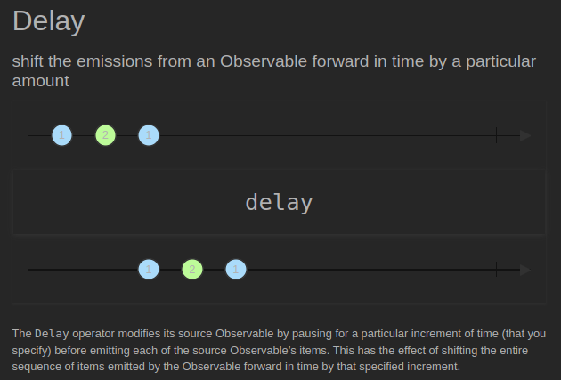
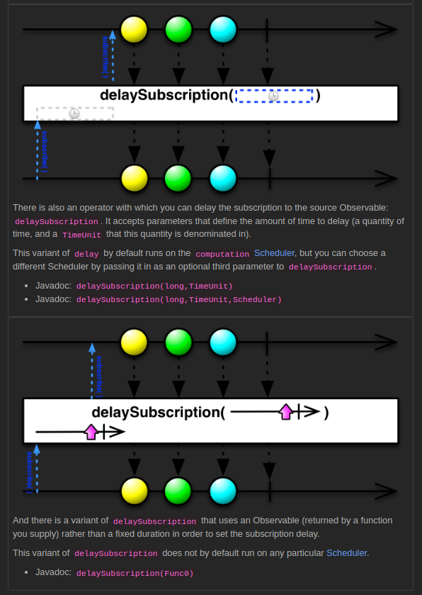
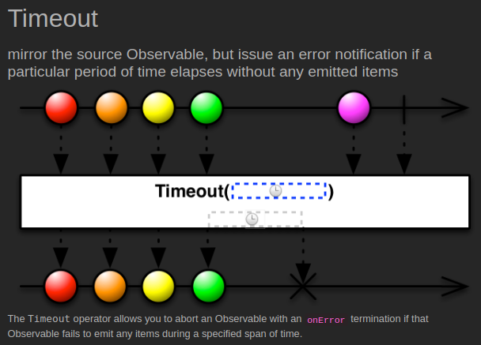
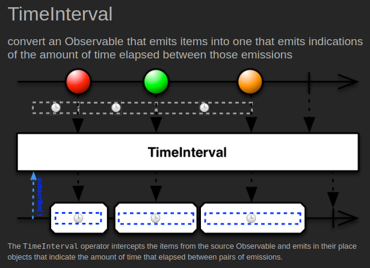
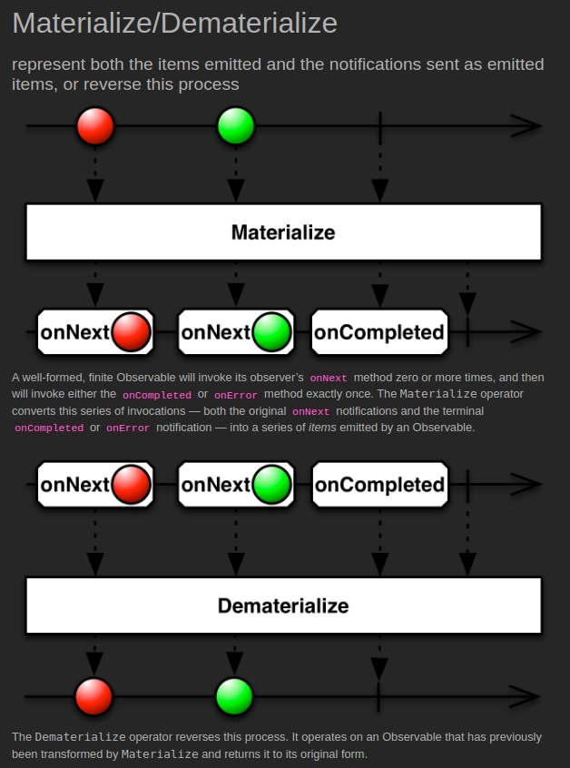

# Utility

[[Docs] Observable Utility Operators](https://reactivex.io/documentation/operators.html#utility)

## [Delay](https://reactivex.io/documentation/operators/delay.html) ([Example Code](../src/main/java/me/zeroest/rxjava/operators/utility/Delay.java))

유형1
- 생산자가 데이터를 생성 및 통지를 하지만 설정한 시간만큼 소비자쪽으로의 데이터 전달을 지연시킨다.

유형2
- 파라미터로 생성되는 Observable이 데이터를 통지할때까지 각각의 원본 데이터의 통지를 지연시킨다.

## [DelaySubscription](https://reactivex.io/documentation/operators/delay.html) ([Example Code](../src/main/java/me/zeroest/rxjava/operators/utility/DelaySubscription.java))

- 생산자가 데이터의 생성 및 통지 자체를 설정한 시간만큼 지연시킨다.
- 즉, 소비자가 구독을 해도 구독 시점 자체가 지연된다.

## [Timeout](https://reactivex.io/documentation/operators/timeout.html) ([Example Code](../src/main/java/me/zeroest/rxjava/operators/utility/Timeout.java))

- 각각의 데이터 통지 시, 지정된 시간안에 통지가 되지 않으면 에러를 통지한다.
- 에러 통지시 전달되는 에러 객체는 TimeoutException이다.

## [TimeInterval](https://reactivex.io/documentation/operators/timeinterval.html) ([Example Code](../src/main/java/me/zeroest/rxjava/operators/utility/TimeInterval.java))

- 각각의 데이터가 통지되는데 걸린 시간을 통지한다.
- 통지된 데이터와 데이터가 통지되는데 걸린 시간을 소비자쪽에서 모두 처리할 수 있다.

## [Materialize / Dematerialize](https://reactivex.io/documentation/operators/materialize-dematerialize.html) ([Example Code](../src/main/java/me/zeroest/rxjava/operators/utility/Materialize.java))

Materialize
- 통지된 데이터와 통지된 데이터의 통지 타입 자체를 Notification 객체에 담고 이 Notification 객체를 통지한다.  
즉, 통지 데이터의 메타 데이터를 포함해서 통지한다고 볼 수 있다.

Dematerialize
- 통지된 Notification 객체를 원래의 통지 데이터로 변환해서 통지한다.
