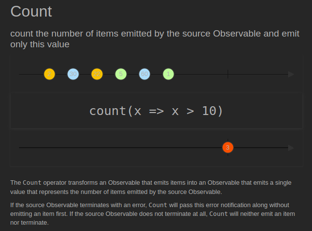
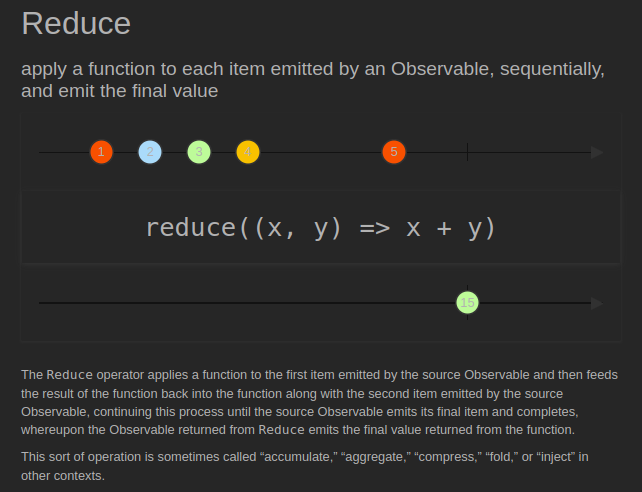
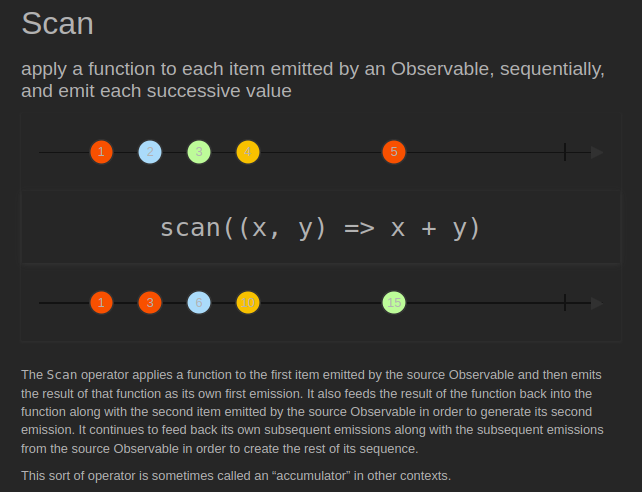

# Mathematical and Aggregate

[[Docs] Mathematical and Aggregate Operators](https://reactivex.io/documentation/operators.html#mathematical)

## [Count](https://reactivex.io/documentation/operators/count.html) ([Example Code](../src/main/java/me/zeroest/rxjava/operators/mathematicalaggregate/Count.java))

- Observable이 통지한 데이터의 총 개수를 통지한다.
- 총 개수만 통지하면 되므로 결과 값은 Single로 반환된다.
- 데이터의 총 개수를 통지하는 시점은 완료 통지를 받은 시점이다.

## [Reduce](https://reactivex.io/documentation/operators/reduce.html) ([Example Code](../src/main/java/me/zeroest/rxjava/operators/mathematicalaggregate/Reduce.java))

- Observable이 통지한 데이터를 이용해서 어떤 결과를 일정한 방식으로 합성한 후, 최종 결과를 반환한다.
- Observable이 통지한 데이터가 숫자일 경우 파라미터로 지정한 함수형 인터페이스에 정의된 계산 방식으로 값을 집계할 수 있다.

## [Scan](https://reactivex.io/documentation/operators/scan.html) ([Example Code](../src/main/java/me/zeroest/rxjava/operators/mathematicalaggregate/Sacn.java))

- Reduce와 동일하나 집계 중간 결과를 계속해서 출력한다.
