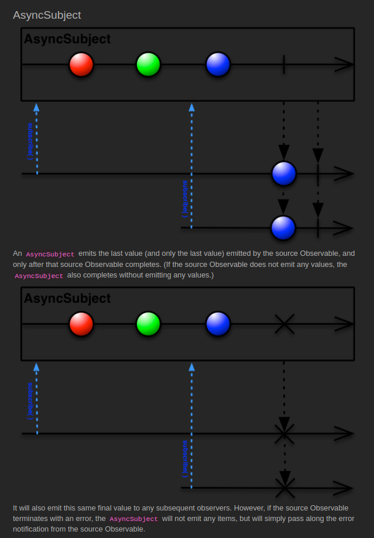

# AsyncSubject

[Example Code](../src/main/java/me/zeroest/rxjava/subject/Async.java)

- 완료 전까지 아무것도 통지하지 않고 있다가 완료했을 때 마지막으로 통지한 데이터와 완료만 통지한다.
- 모든 소비자는 구독 시점에 상관없이 마지막으로 통지된 데이터와 완료 통지만 받는다.
- 완료 후에 구독한 소비자라도 마지막으로 통지된 데이터와 완료 통지를 받는다.
