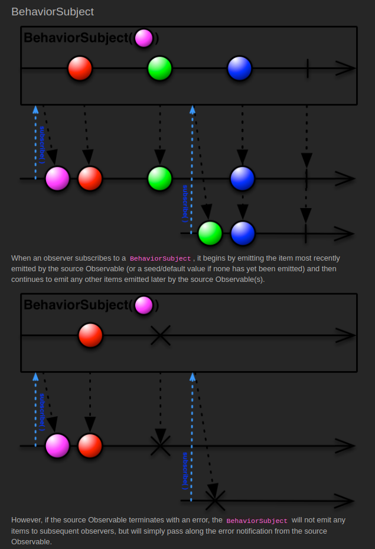

# BehaviorSubject

[Example Code](../src/main/java/me/zeroest/rxjava/subject/Behavior.java)

- 구독시점에 이미 통지된 데이터가 있다면 이미 통지된 데이터의 마지막 데이터를 전달 받은 후,  
  구독 이후에 통지된 데이터를 전달 받는다.
- 처리가 완료된 이후에 구독하면 완료나 에러 통지만 전달 받는다.
