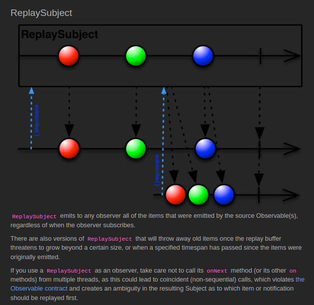

# ReplaySubject

[Example Code](../src/main/java/me/zeroest/rxjava/subject/Replay.java)

- 구독 시점에 이미 통지된 데이터가 있다면 이미 통지된 데이터 중에서 최근 통지된 데이터를 지정한 개수만큼 전달 받은 후,  
  구독 이후에 통지된 데이터를 전달 받는다.
- 이미 처리가 완료된 이후에 구독하더라도 지정한 개수 만큼의 최근 통지된 데이터를 전달 받는다.
