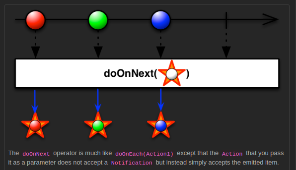

## doOnNext

[Example Code](../src/main/java/me/zeroest/rxjava/do_xxx/DoOnNext.java)

- 생산자가 데이터를 통지하는 시점에, 지정된 작업을 처리할 수 있다.
- onNext 이벤트가 발생하기 직전에 실행된다.
- 통지된 데이터가 함수형 인터페이스의 파라미터로 전달되므로 통지 시점마다 데이터의 상태를 확인할 수 있다.
