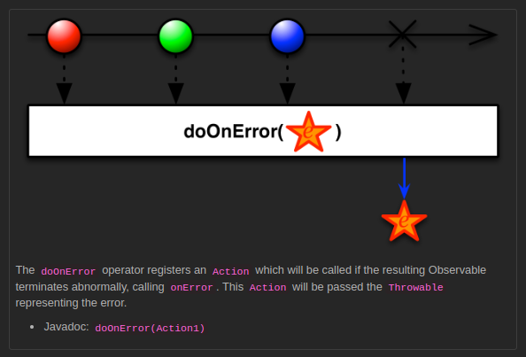

## doOnError

[Example Code](../src/main/java/me/zeroest/rxjava/do_xxx/DoOnError.java)

- 생산자가 에러를 통지하는 시점에, 지정된 작업을 처리할 수 있다.
- onError 이벤트가 발생하기 직전에 실행된다.
- 통지된 에러 객체가 함수형 인터페이스의 파라미터로 전달되므로 에러 상태를 확인할 수 있다.
